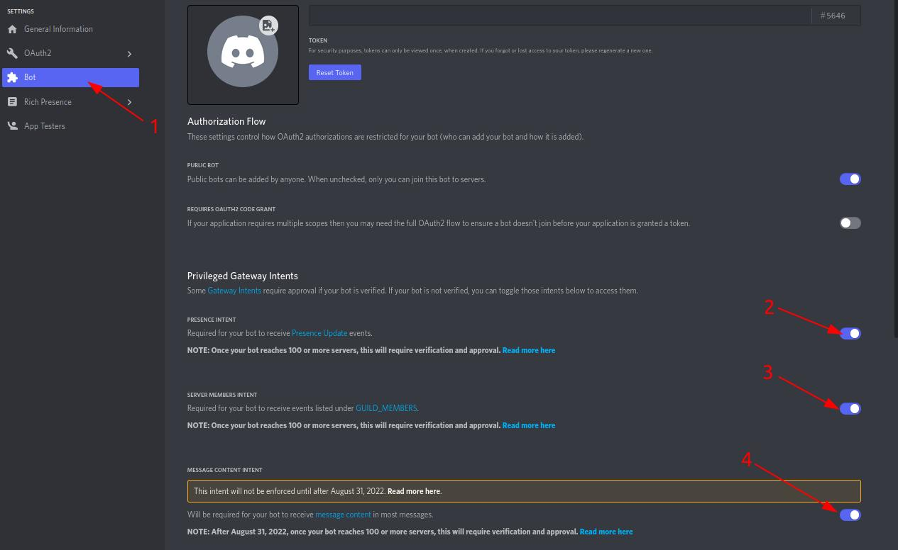
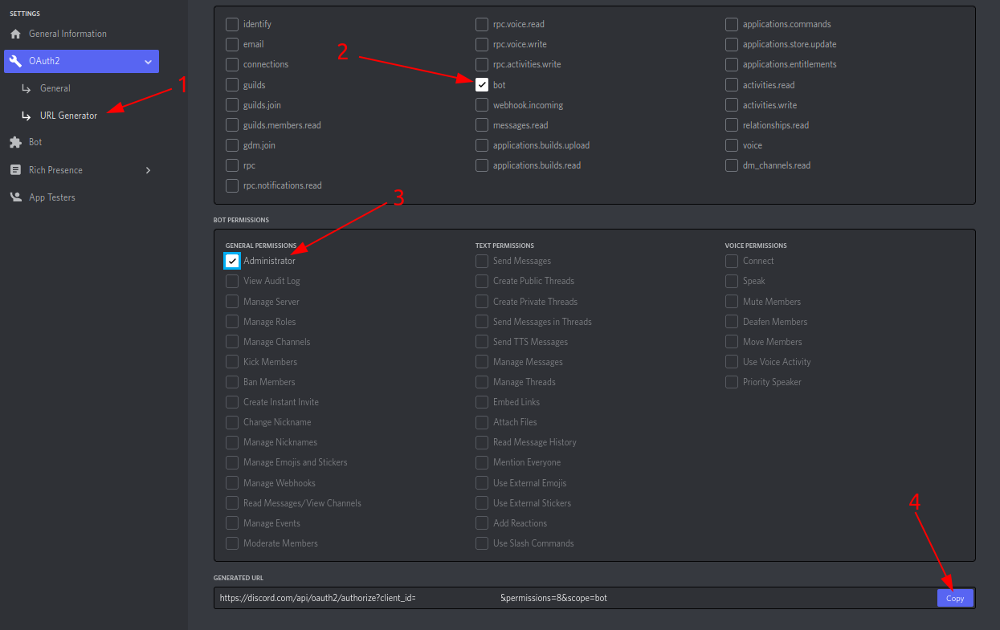

# Custom Bot

## Custom Bot

You can find here how to setup custom bot. You need this if you have tier 3+ by redeeming it or by winning in our support server.
1. Go to [Discord Dev Portal](https://discord.com/developers/applications)

2. Create a new Application

3. Enter a name and press the create button

4. Go to `Bot` and click `Add Bot`

5. Enable the intents

6. Generate the invitation link, copy it and invite the bot to your server

7. Copy the `Application ID` and `Token` to your Clipboard

8. Go to the Dashboard and select the server where you want to have premium.

- Then paste the copied `Application ID` and `Token` to `Client ID` and `Token`

9.Change the Prefix from `!!` to any of your choice

10.Press `Save Bot` and your bot should go online

and that's it.
