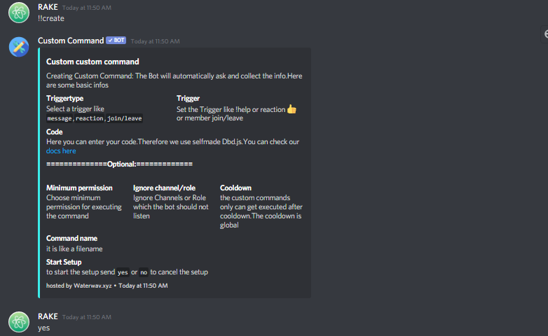

# Begin



The Full Tutorial of Custom Command Bot

This is just a demo 😊

### Getting Started with Dashboard\(1\*Vote required\)

1. Go to[ https://ccommandbot.ga](%20https://ccommandbot.ga) 


### Getting Started using Commands




## Code Syntax

The Syntax has been inspired from bdfd/dbd.js originally. The syntax so very similar and we try to keep error handling the same to have a really good ux. 


We are not affiliated with dbd.js/bdfd/bd-script. We just use their syntax  
btw **Functions gets executed Reversed** so think a little bit **upside-down**


### Syntax

**$**  -&gt; every Function starts with a usd  
**Functionname** --&gt; function name like sub,sum ..  
//only with functions with parameters  
**\[**-&gt;start of Parameter  
**value1**-&gt;your first Value  
**;** -&gt; Separator. This Separator separates the value  
**second value** .....separte every value with a ;  
**\]**end of Function  
  
**\*functions** are case sensitive.So `$addCmdReactions[ 🧨;  😉]` will not work since it has white space. So remove unnecessary white spaces,

The Functions return values or execute something. like $year would replace it with 2021

Example:

```text
The year Today is: $year
```

This would just replace $year and output The year Today is: 2021.

Example2:

```text
Hello my Name is <@$authorID>
```

This would just output : Hello my Name is Rake

Example3:

```text
$giveRoles[$auhtorID;roleid]
```

This would return nothing since it executes a functions. The Bot would give the role.

